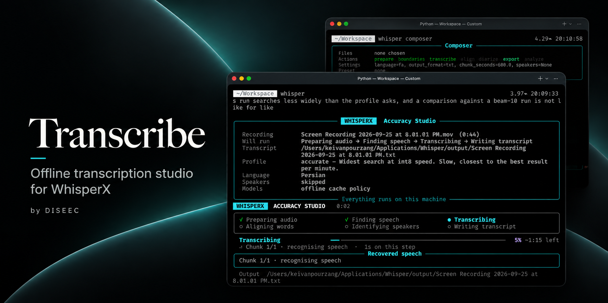

<div align="center">

# Transcribe

### Your recordings. Useful text. Your machine.

Fast, private, resumable transcription for audio and video.

[](https://www.python.org/)
[](#platforms)
[](#platforms)
[](docs/RELIABILITY.md#validation)
[](LICENSE)



**[Get started](#quickstart)** · **[See features](#features)** · **[Read the guide](docs/USER_GUIDE.md)**

</div>

## ✨ From recording to ready-to-use text

Meetings, interviews, lectures, podcasts, voice notes, and screen recordings become
timestamped transcripts without a hosted transcription service.

**Persian and English are first-class workflows.** The Whisper engines underneath are
multilingual, and advanced automation can use other language codes with compatible models
and alignment resources.

<br>

<a id="features"></a>

## 🚀 Built for real recordings

### 🔒 Private by design

Recognition runs locally. After setup and model downloads, no transcription API is needed.
Use cache-only mode when the machine must stay offline.

### ⚡ Fast when time matters

Choose `fast`, `balanced`, `accurate`, or `maximum`. Profiles coordinate model settings,
beam search, batching, precision, and available memory for you.

### ⏯️ Resume instead of restart

Long recordings are saved chunk by chunk. If a run stops, completed work survives and the
next run continues from it.

### 🧩 Build the pipeline you need

Transcribe, align words, label speakers, export, compare, or analyze. Run the full flow or
only the stage that changed.

### 🤖 Ready for automation

Stable commands, deterministic one-shot settings, meaningful exit codes, presets, and plain
redirected output fit scripts, agents, batch jobs, and larger media pipelines.

### 🎛️ Bring your runtime and model

Use WhisperX or whisper.cpp. Select a standard model, a compatible Hugging Face repository,
or a local GGML model and make the speed/quality tradeoff explicit.

<br>

<a id="quickstart"></a>

## 🏁 Start in minutes

**1. Prepare**

```bash
./cli install
./cli resources
./cli status
```

**2. Open the guided experience**

```bash
./cli
```

**3. Or transcribe immediately**

```bash
./cli /path/to/recording.m4a
```

Python 3.10-3.13 and FFmpeg are required. For batches:

```bash
./cli transcribe meeting.m4a interview.mov --language en
```

<br>

## 🧭 Work your way

### 👋 Guided

Choose recordings, workload, and quality from a clear menu.

```bash
./cli
```

### 🎯 One-shot

Give Transcribe a path. Personal settings cannot silently change the result.

```bash
./cli recording.m4a
```

### 🛠️ Configurable

Control the model, engine, quality, stages, speakers, network mode, and output.

```bash
./cli run recording.m4a --profile accurate --output-format all
```

### 🧱 Composer

Build complex multi-file jobs interactively and preview the plan before running.

```bash
./cli composer
```

All four paths use the same pipeline and output contracts.

<br>

## 🔗 A pipeline, not a black box

```text
prepare → boundaries → transcribe → align → speakers → export → analyze
```

Reuse cached work instead of repeating expensive stages:

```bash
./cli run recording.m4a --only export --output-format all
./cli run recording.m4a --only diarize
./cli run recording.m4a --without diarize
./cli run recording.m4a --dry-run
```

Save preferences and named presets for workflows you repeat. Transcribe shows the resolved
plan and rejects impossible combinations before execution.

<br>

## 🍎 Tuned for Apple Silicon. Portable by design.

Apple Silicon is the most heavily optimized target. Transcribe detects performance cores,
adapts to available memory, and uses whisper.cpp for Metal-accelerated recognition.

WhisperX provides the dependable CPU-oriented path and the default Linux setup.

**[Engines and models](docs/ENGINES_AND_MODELS.md)** ·
**[Measured tradeoffs](docs/BENCHMARKS.md)**

<br>

<a id="platforms"></a>

## 🖥️ Runs where you work

- **macOS · Apple Silicon** — whisper.cpp with Metal acceleration
- **Linux · x86_64 / amd64** — WhisperX by default
- **Linux · aarch64 / arm64** — WhisperX in a native environment
- **Optional on Linux** — natively built whisper.cpp

Virtual environments stay architecture-specific. Compatible model data can be reused.

<br>

## 📦 Outputs for the next step

**Readable text** · **SRT subtitles** · **WebVTT** · **TSV timelines** ·
**structured JSON** · **Audacity labels**

Every recognition writes canonical timestamped `.raw.txt` and `.raw.json` first. Optional
word timing and speaker labels flow into formats that support them.

<br>

## 🛡️ Honest results, even when something fails

- Canonical text is saved before optional refinements.
- Failed chunks retry with lower resource pressure.
- Changed settings invalidate only work that is no longer trustworthy.
- Missing time ranges are shown explicitly.
- Partial results are marked `INCOMPLETE` and return a non-zero exit code.

The repository is backed by **852 automated tests** covering the pipeline, engines, cache,
resume behavior, rendering, comparison, terminal UI, and integration boundaries.

**[Reliability contract](docs/RELIABILITY.md)** ·
**[Architecture](docs/ARCHITECTURE.md)**

<br>

## 📚 Go deeper

- **[User Guide](docs/USER_GUIDE.md)** — setup, workflows, presets, stages, and outputs
- **[Engines and Models](docs/ENGINES_AND_MODELS.md)** — runtimes, model choice, Apple Silicon, Linux, and offline use
- **[Reliability](docs/RELIABILITY.md)** — resume, retries, coverage, cache invalidation, and exit behavior
- **[Benchmarks](docs/BENCHMARKS.md)** — measured speed and quality tradeoffs
- **[Contributing](CONTRIBUTING.md)** — development setup and pull requests
- **[Support](SUPPORT.md)** · **[Security](SECURITY.md)** · **[Third-Party Notices](THIRD_PARTY_NOTICES.md)**

<br>

<div align="center">

Built for recordings that matter. Released under the **[MIT License](LICENSE)**.

</div>
